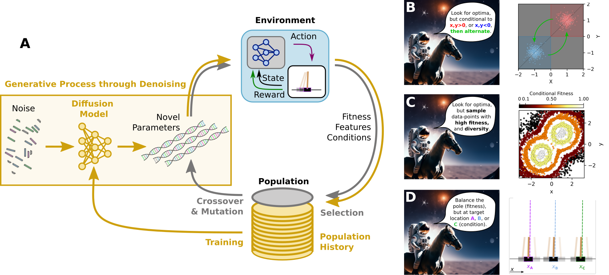

# Conditional Diffusion Evolution

Diffusion Models (DMs) and Evolutionary Algorithms (EAs) share a core generative principle: iterative refinement of random initial distributions to produce high-quality solutions. DMs degrade and restore data using Gaussian noise, enabling versatile generation, while EAs optimize numerical parameters through biologically inspired heuristics. Our research integrates these frameworks, employing deep learning-based DMs to enhance EAs across diverse domains. By iteratively refining DMs with heuristically curated databases, we generate better-adapted offspring parameters, achieving efficient convergence toward high-fitness solutions while preserving explorative diversity. DMs augment EAs with deep memory, retaining historical data and exploiting subtle correlations for refined sampling. Classifier-free guidance further enables precise control over evolutionary dynamics, targeting specific genotypical, phenotypical, or population traits. This hybrid approach transforms EAs into adaptive, memory-enhanced frameworks, offering unprecedented flexibility and precision in evolutionary optimization, with broad implications for generative modeling and heuristic search.


(**A**) A schematic flow-chart of a typical evolutionary algorithm (gray arrows and labels) contrasted with our diffusion model (DM)-based evolutionary optimization (golden arrows and symbols), showing an evolutionary process either utilizing population-based (gray) or an ANN-based DM (golden) as heuristically refined generative model for offspring-genotype sampling. The DM-based EA's generative model learns from heuristic experience by training on an epigenetic joint dataset of genome, fitness, and (potentially) conditional feature data of a particular genotype in its environment. We then utilize the successively refined DM to sample high-quality (high fitness) offspring candidate solutions for a particular environment; via classifier-free-guidance techniques, this generative process can potentially be biased towards desired target traits in the environment on the phenotypic level.

(**B**) Schematics of DM-based evolutionary optimization in an environment with two Gaussian optima at $\mu_\pm=(\pm1,\pm1)$, but conditioning the search dynamics either to a target parameter range $x,y>0$ (red) or $x,y<0$ (blue), or alternate between the two peaks through dynamic conditioning  (green).

(**C**) Schematics of utilizing conditional DM evolution of high-fitness genotypes (low to high fitness color-coded from black through orange to white) that maintains diversity (spread in parameter space).

(**D**) Schematic behavior of DM-based conditionally evolved reinforcement learning (RL) agents deployed in the cart-pole environment the agents are evolved to maximize fitness (balance the pole), but conditionally sampled to steer the cart to a certain location (here A, B, or C) without changing the reward signal.

---

The package comprises methods from the Heuristically Adaptive Diffusion-Model Evolutionary Strategy (HADES) framework.[^1]
- [`condevo.es.HADES`](condevo/es/heuristical_diffusion_es.py): Heuristically Adaptive Diffusion-Model Evolutionary Strategy
- [`condevo.es.CHARLES`](condevo/es/conditional_diffusion_es.py): Conditional, Heuristically-Adaptive ReguLarized Evolutionary Strategy through Diffusion

**Note**: The package is under active development.

---

The method is complementary to our [*Diffusion Evolution* framework](https://github.com/Zhangyanbo/diffevo), which shows the equivalence that *Diffusion models are Evolutionary Algorithms*. [^2]

[^1]: B. Hartl, Y. Zhang, H. Hazan, M. Levin, Heuristically Adaptive Diffusion-Model Evolutionary Strategy, Advanced Science, in press (2026), DOI [10.1002/advs.202511537](https://doi.org/10.1002/advs.202511537), [arxiv:2411.13420](https://arxiv.org/abs/2411.13420) (2024)

[^2]: Y. Zhang, B. Hartl, H. Hazan, M. Levin, ICLR (2025), [OpenReview](https://openreview.net/forum?id=xVefsBbG2O), [arxiv:2410.02543](https://arxiv.org/abs/2410.02543)

## Project
The main package is located in the [condevo](condevo) folder, which comprises 
- a [diffusion](condevo/diffusion) sub-package, implementing diffusion models (DDIM, RectFlow, VPred, XPred) and related utilities,
- a [nn](condevo/nn) sub-packages, implementing neural network architectures (MLP, UNet, SelfAttention, ...) forming the predictive backbone of the diffusion models,
- an [es](condevo/es) sub-package, implementing evolutionary strategies (HADES, CHARLES, CMA-ES, SimpleGA, etc),
- a [utils](condevo/preprocessing) sub-package, implementing utility functions for data preprocessing, logging, etc.
- and several utility functions for logging and statistics.

## Installation

From within your desired python environment, you may install the repository [optionally in developer mode, `-e`] via
```bash
pip install -e .
```

### Example Dependencies
To install dependencies for the examples, you might first install the code depends on the following packages:
- `foobench` (see [install instructions](https://github.com/bhartl/foobench) on GitHub)
- `mincraft` (see [install instructions](https://github.com/bhartl/NeurEvo) on GitHub)

You may install the examples dependencies via
```bash
pip install -e .[examples]
```


### Mainly tested via CPU-only Usage:
Since the code is intended for evolutionary optimization, the parallelization is done across environment evaluations. Thus, we mainly applied the code without GPU usage, and you may install the cpu-only version of PyTorch  via
```bash
pip install -e . --extra-index-url https://download.pytorch.org/whl/cpu
```

## Examples
see the [examples](examples) directory for example usage of the methods.

## Citation
If you use this code in your research, please cite the following paper:
```bibtex
@article{Hartl2024HADES,
      title={Heuristically Adaptive Diffusion-Model Evolutionary Strategy}, 
      author={Benedikt Hartl and Yanbo Zhang and Hananel Hazan and Michael Levin},
      journal={Advanced Science, in press}
      doi={10.1002/advs.202511537},
      year={2026},
      note = {Code available at \url{https://github.com/bhartl/condevo}; Preprinted as arxiv:2411.13420 (2024)},
}
```

